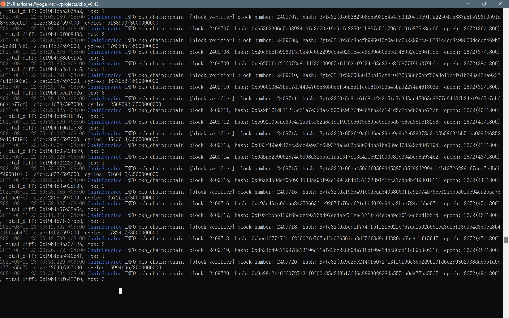

# nervos Gitcoin

### Gitcoin: 0) Setup A local CKB Node And CKB Indexer For The Testnet

- Setup a CKB Node

  

- Setup a CKB Indexer

  

### Gitcoin: 1) Create A Godwoken Account On The EVM Layer 2 Testnet

- Create and Fund an Account with CKBytes on Layer 1

  

  address:                                                                                                                                                                          

  mainnet: ckb1qyqw59uahvufc5kre5k3w3y8wjuvd3j7vd7qhh9hf3                                                                                                                          testnet: ckt1qyqw59uahvufc5kre5k3w3y8wjuvd3j7vd7q2jmg9d                                                                                                                        lock_arg: 0xea179dbb389c52c3cd2d17448774b8c6c65e637c                                                                                                                             lock_hash: 0x2466be55ae490c6474f7d25743f3491a88fd6ebf7f02904c44fa2fc20d4a658d  

- Deposit some CKBytes on Layer 2

### Gitcoin: 2) Deploy A Simple Ethereum Smart Contract On Polyjuice

### Gitcoin: 3) Issue A Smart Contract Call To The Deployed Smart Contract

